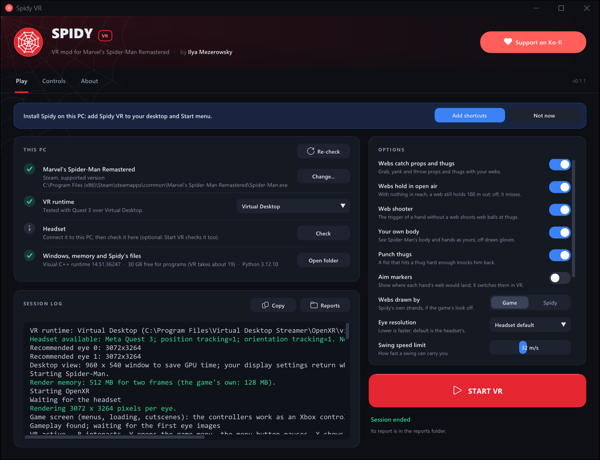

<p align="center">
  
</p>

<h1 align="center">Spidy</h1>

<p align="center">
  <b>VR for Marvel's Spider-Man Remastered</b><br>
  Swing on webs with your own arms, shoot from your wrists, punch with your fists.
</p>

<p align="center">
  <a href="https://ko-fi.com/ilyamezerowsky"></a>
  <a href="https://discord.gg/x27ZXDpdNt"></a>
</p>

<p align="center">
  <a href="https://github.com/IlyaMez/Spidy/releases/latest"><b>Download the latest release</b></a>
  ·
  <a href="docs/PLAYERS.md">Players' guide</a>
  ·
  <a href="docs/CHANGELOG.md">What's new</a>
</p>

Spidy is a free fan mod by **Ilya Mezerowsky** that puts Marvel's Spider-Man
Remastered in VR: native stereo at your headset's resolution, 6DoF head and
hands, and web swinging you control with your arms. Spidy is free; if you
enjoy it, a tip on [Ko-fi](https://ko-fi.com/ilyamezerowsky) keeps the updates
coming. Questions, bugs, clips: come say hi on
[Discord](https://discord.gg/x27ZXDpdNt).

<p align="center">
  
</p>

> **Early and in development.** Played on Quest 3 through Virtual Desktop.
> Spidy supports one Steam build of the game; a game update needs a Spidy update.

## Features

- 🕸️ **Physical web swinging.** Squeeze a grip to fire that hand's web where you
  point, swing on it, reel in with the trigger, pull sharply to zip. Webs hold on
  buildings, the ground, or open air.
- 🎯 **Web shooter.** The trigger of a hand without a web fires the game's own
  web ball from your wrist, with aim assist on thugs. Three quick hits web a
  thug up.
- 🪢 **Grab and throw.** Web a prop or a thug, reel or yank it in, swing it on
  the web and let go to throw it. Heavy things feel heavy. Pulled thugs fly
  flailing, and get hurt when they slam into walls, the ground or each other.
- 🦸 **You are Spider-Man.** Look down and see his body; his arms and hands
  follow your controllers. A quick T-pose the first time sizes him to your
  height and arm length.
- 👊 **Real punches.** A fast fist into a thug lands the game's own melee hit,
  harder the faster you swing.
- ⚙️ **VR settings in the game's menu.** A SPIDY VR tab in the game's own
  Settings for aim markers, snap or smooth turning, vibration, swing speed,
  how heavy you swing, screen size and more. Changes apply at once.
- 🖥️ **Menus and cutscenes on a screen.** The Touch controllers work as an
  Xbox controller there; VR resumes when play does.

## What you need

- **Marvel's Spider-Man Remastered on Steam.** The Epic Games Store version is a
  different build.
- **A PC VR headset with an OpenXR runtime.** Played on Quest 3 with
  [Virtual Desktop](https://www.vrdesktop.net/) and with SteamVR (Steam Link);
  other SteamVR headsets and Quest Link should work.
- **About 19 GB of memory Windows can give programs** (RAM plus page file). The
  launcher shows how much you have.

## Install and play

1. Download the zip from [Releases](https://github.com/IlyaMez/Spidy/releases/latest)
   and extract it to a folder you can write to, such as `Documents\Spidy`.
2. Start **Spidy Launcher.exe**. If Windows says it protected your PC, choose
   *More info*, then *Run anyway*.
3. Fix anything marked red. The launcher can install the Visual C++ runtime for
   you, and *Add shortcuts* puts Spidy VR on your desktop and Start menu.
4. Connect your headset, close the game, and press **START VR**. Pick your save
   with the VR controllers; VR takes over as soon as you play.

Keep the game window in front on the desktop: the game pauses behind other
windows. If the headset shows a still picture, click the game window once.

### What the launcher does

- Finds the game in your Steam libraries and checks it is the supported build.
- Finds the OpenXR runtime your headset is connected to (or the one you choose) and checks the headset.
- Checks the Visual C++ runtime, available memory and Spidy's own files.
- Starts the game with the larger render memory VR needs, in a small window that
  saves GPU time, and puts your window settings back afterwards.
- Remembers your options, and saves a report of every session in `reports\`.

Spidy changes nothing in the game's folder.

## Controls

| Do this | With |
|---|---|
| Shoot a web, swing on it | Squeeze a **grip**; release to let go |
| Reel in | **Trigger**, while that hand's web is attached |
| Zip | Pull the hand sharply away from the anchor |
| Shoot a web ball | **Trigger** of a hand without a web |
| Grab a prop or thug | Grip aimed at it; trigger reels it, a sharp pull yanks it, release throws it |
| Punch | A fast fist into a thug |
| Walk and run / jump | **Left stick** / **A** (from the ground, a wall or a perch; no web zip in the air) |
| Flip (experimental, off by default: FLIPS in VR settings or the launcher) | Tap **A** in the air: one flip toward where the left stick points. Hold **A** in the air: the left stick turns you, as fast as you tilt it; let go to come back level |
| Turn | **Right stick**: snap 30° (adjustable or off), or hold to turn smoothly with SMOOTH TURN on in VR settings |
| Interact (the game's Y) | **B** |
| Pause (VR settings: Settings > SPIDY VR) | **Menu** button |
| Game menu (map, suits, skills) | **Y** |
| Show or hide aim markers | **X** |
| Switch between VR and a flat screen | Click **both sticks** |

**Aim markers** show where each free hand's web would go, blue for the left
hand and orange for the right: a ring holds, a dashed ring holds in open air,
a red cross misses, a turning ring of three arcs catches a prop or thug.

## Troubleshooting

| Problem | Fix |
|---|---|
| "This game version is not supported" | The game was updated, or it is not the Steam version. Wait for a Spidy update. |
| The headset is not found | Connect it first, check the VR runtime in the launcher, press *Check*. |
| The picture breaks up | Close the game and start it from the launcher, which gives it the render memory VR needs. |
| Low frame rate | Lower *Render resolution* in the launcher, or the streaming quality in Virtual Desktop. 90 Hz paces more evenly than 120 Hz. |
| Blurry or jagged edges | Raise *Render resolution* in the launcher above 100% (try 125%); it costs frame rate and memory. |
| A memory warning before start | Close big programs (browsers, chat apps), or [give Windows a larger page file](docs/DEVELOPMENT.md#memory-for-a-vr-session). |
| Web balls fly when you meant to reel | The trigger reels only while that hand's web is attached; on a hand without a web it shoots. |

More fixes are in the [players' guide](docs/PLAYERS.md). When you report a
problem, attach the session's report from the `reports` folder, on
[Discord](https://discord.gg/x27ZXDpdNt).

## Building from source

Needs Visual Studio 2022 C++ Build Tools with CMake and Ninja, and a Windows SDK.

```powershell
.\tools\bootstrap.ps1 -Observer   # dependencies, including Dear ImGui for the launcher
.\tools\build.ps1 -Observer       # build\windows-ninja
.\build\windows-ninja\spidy_tests.exe
.\tools\package.ps1               # dist\Spidy-<version>-win64.zip
```

`Launch Spidy VR.cmd` runs VR straight from a checkout, and `Launch Spidy Lab.cmd`
opens a standalone OpenXR swinging lab that needs no game. Releases are built on
GitHub: **Actions > Release > Run workflow**.

## How it works

Spidy loads its modules into the running game and renders two extra scene views
through the game's own renderer, one per eye, at the headset's resolution and
lens, then hands them to OpenXR. Swinging is Spidy's own rope physics steering
the game's mover against the game's collision world; the webs you see, the web
shooter's shots, thrown props and punches are the game's own systems, fed from
your tracked hands.

| Read more | |
|---|---|
| [Players' guide](docs/PLAYERS.md) | Setup, every control and fix (the zip's `README.txt`) |
| [Changelog](docs/CHANGELOG.md) | Every build: what changed, why, and what was measured |
| [Development notes](docs/DEVELOPMENT.md) | Launcher and release internals, tools, launch options, memory and graphics in VR, the lab |
| [Validation](docs/VALIDATION.md) | What passed locally, and what still needs a game or headset |
| [Web grab](docs/WEB-GRAB.md) · [Body](docs/BODY.md) | Design and measurements of those features |
| [Milestone 1](docs/MILESTONE-1.md) · [Reference](docs/REFERENCE.md) | Acceptance criteria, game research, sources |

## Support

Spidy is free, and built with a lot of AI help whose tokens aren't. If you
enjoy it, [support it on Ko-fi](https://ko-fi.com/ilyamezerowsky) and
[join the Discord](https://discord.gg/x27ZXDpdNt).

Please share the original release zip with its credit intact, so players get
working files and know where updates come from.

Spidy is a free fan project, not affiliated with or endorsed by Insomniac Games,
Sony Interactive Entertainment, Marvel or Valve. Third-party licences are in
[THIRD_PARTY_NOTICES.md](THIRD_PARTY_NOTICES.md) and [docs/licenses](docs/licenses).
